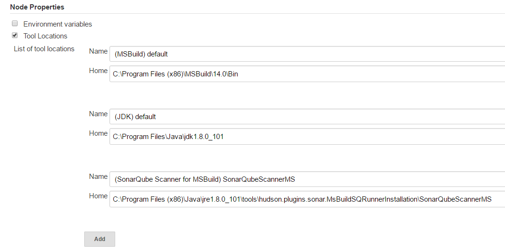

# Wintel Pipeline

# Jenkins
First, see the [Jenkinsfile](Jenkinsfile) for the pipeline definition.

**Example**
```java
node ('windows') {
    timestamps{
        stage('Checkout') {
            git credentialsId: 'joost-github', url: 'https://github.com/joostvdg/c-sharp-example.git'
        }

        def sonarHome = tool name: 'SonarQubeScannerMS', type: 'hudson.plugins.sonar.MsBuildSQRunnerInstallation'
        stage('Sonar Start'){
            // start
            bat "\"${sonarHome}\\MSBuild.SonarQube.Runner.exe\" begin /key:ProjectKey /name:ProjectName /version:1.0"
        }

        stage('Build'){
            def msbuildHome = tool name: 'default', type: 'hudson.plugins.msbuild.MsBuildInstallation'
            echo "msbuildHome=${msbuildHome}"
            bat "\"${msbuildHome}\\msbuild\" /t:Rebuild"
        }

        stage('Sonar Finish'){
            // finish
            // step([$class: 'MsBuildSQRunnerEnd'])
            bat "\"${sonarHome}\\MSBuild.SonarQube.Runner.exe\" end"
        }

        stage('Publish NuGet Package') {
            withCredentials([[$class: 'FileBinding', credentialsId: 'nuget', variable: 'nuget']]) {
                withCredentials([[$class: 'StringBinding', credentialsId: 'nuget-api-key', variable: 'key']]) {
                    println "env.nuget=${env.nuget}"
                    println "env.key=${env.key}"
                    // bat "\"${env.nuget}\" setApiKey ${env.key} -Source http://localhost:32769/repository/nuget-hosted"
                    bat "\"${env.nuget}\" pack Package.nuspec"
                    bat "\"${env.nuget}\" push Package.1.0.0.nupkg ${env.key} -Source http://localhost:32769/repository/nuget-hosted"
                }
            }
        }
    }
}

```
## Requires nuspec
The packaging with nuget requires a nuspec file. <br>
You can generate this with the nuget.exe as [follows](https://docs.nuget.org/create/creating-and-publishing-a-package):
```bash
nuget spec
```

## Required plugins
* nuget plugin
* sonarqube plugin
* msbuild plugin
* credentials plugin
* plain credentials plugin
* credentials binding plugin

## Required tools
* msbuild v12.0+
* sonarqube for msbuild
* nuget

## Windows node
* msbuild v12.0 or higher
* sonarqube for msbuild installer
* tool locations configured in node configuration



## Jenkins configuration
* put all jobs in a Folder
* add nuget API key for Nexus 3 into secret text credential on Folder
* add nuget.exe as secret file credential (can be folder, can be global)

# Nexus

## NuGet Gallery
Currently only v2 of the NuGet API is supported.

Support for the v3 API doesn't seem to be a priority.
There is little chance that this functionality will make it into Nexus 3 in 2016.

Evidence for this:
* [Question about V3 support](https://issues.sonatype.org/browse/NEXUS-10159 )
* NuGet items on Jira: https://issues.sonatype.org/browse/NEXUS-10030?jql=project%20%3D%20NEXUS%20AND%20status%20in%20(Open%2C%20%22In%20Progress%22%2C%20Reopened%2C%20%22Testing%20In%20Progress%22%2C%20%22To%20Be%20Tested%22%2C%20Blocked%2C%20%22Inactive%20-%20Pending%20Closure%22%2C%20%22Waiting%20for%20Response%22%2C%20%22Waiting%20for%20Review%22%2C%20%22Raw%22%2C%20New%2C%20%22Ready%20for%20Development%22%2C%20Refine%2C%20%22Ready%20to%20Groom%22)%20AND%20component%20%3D%20NuGet

### NuGet plugin
https://wiki.jenkins-ci.org/display/JENKINS/Nuget+Plugin


## Nexus 3 (3.0.2-02)
### NuGet key (ZEPHYR)
* **Nuget Key:** d11d6fee-8eac-3aeb-ac15-8f9477235968
* **nuget setapikey** d11d6fee-8eac-3aeb-ac15-8f9477235968

### Rest call to retrieve the key
* **URL:** http://localhost:32768/service/extdirect
* **Method:** POST


**GET security token**
```json
{
    "action":"rapture_Security",
    "method":"authenticationToken",
    "data":["YWRtaW4=","YWRtaW4xMjM="],
    "type":"rpc",
    "tid":21
}
```

**GET NUGET API KEY**
```json
{
    "action":"nuget_NuGetApiKey",
    "method":"readKey",
    "data":["fXZ2NuA4XNuqooojIXy1HXeWardBDZSaKQZ35YWQB8FyaeFGk2dPqM5VddBIMZ1uTav1T1HySxKuWGPx+PdOk7JO"],
    "type":"rpc",
    "tid":22
}
```

# SonarQube
* [Sonar for MSBuild](http://docs.sonarqube.org/display/SCAN/Analyzing+with+SonarQube+Scanner+for+MSBuild)
* [Scan on commandline](http://docs.sonarqube.org/display/SCAN/From+the+Command+Line)
* [Configure in Jenkins freestyle](http://docs.sonarqube.org/display/SCAN/From+Jenkins)

## SonarQube API Key
As of SonarQube 5, it requires an API Key.
* **Zephyr:** 5459d8e4d84302dbf9578db5192c37b7b092a7b9
